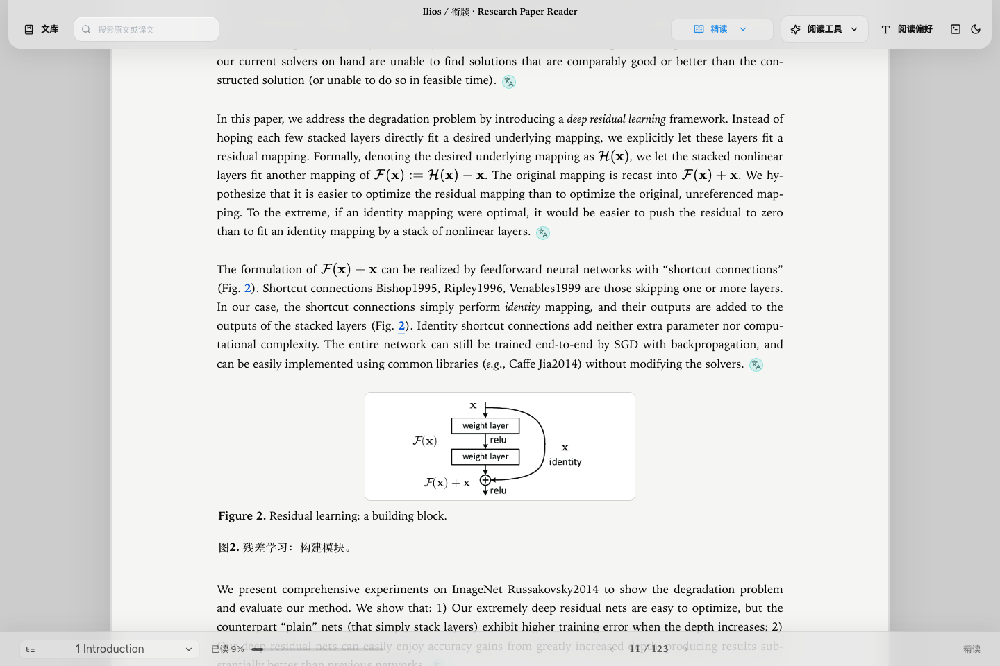
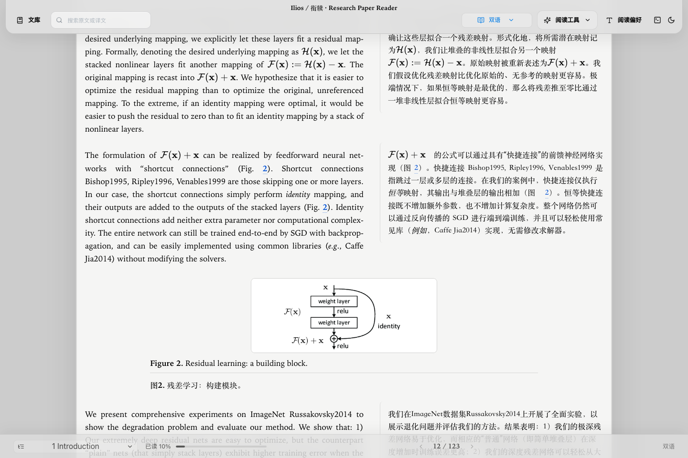
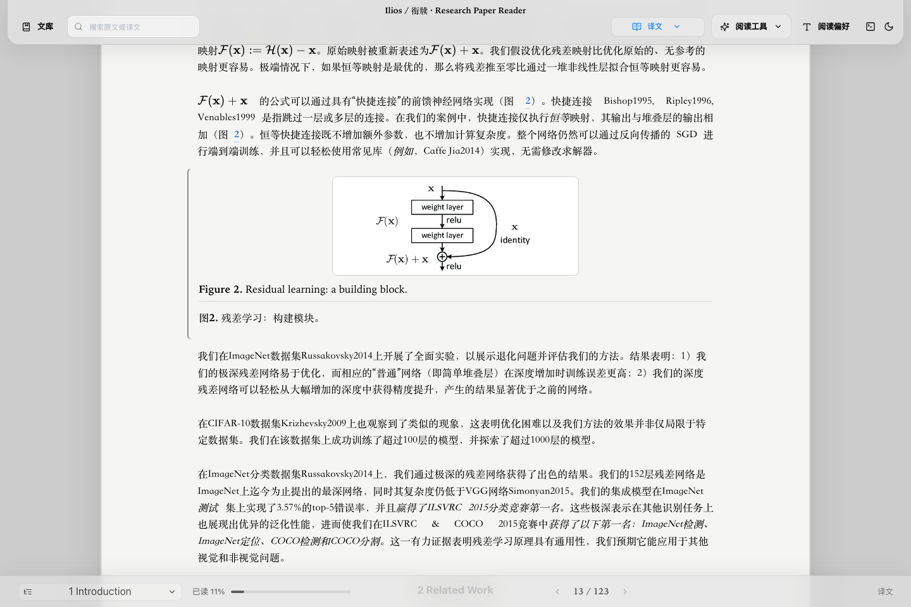
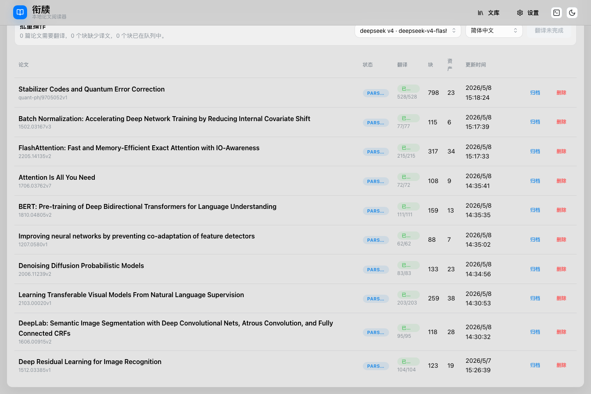
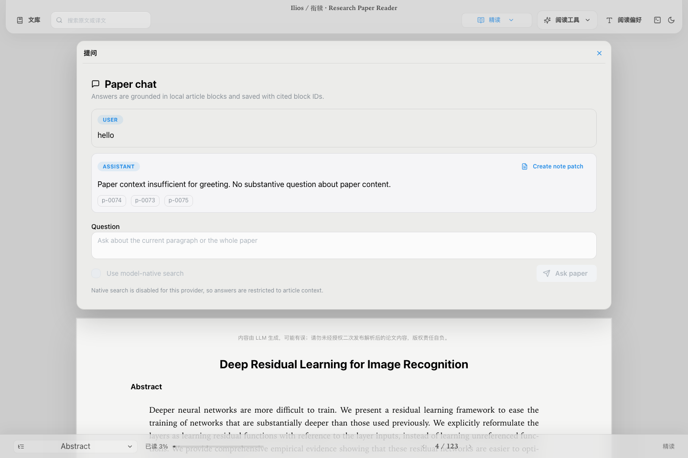
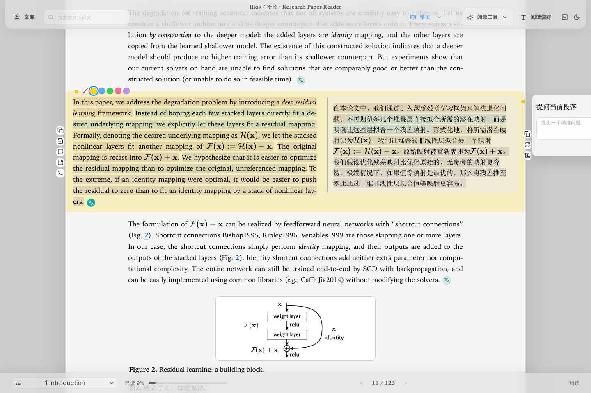
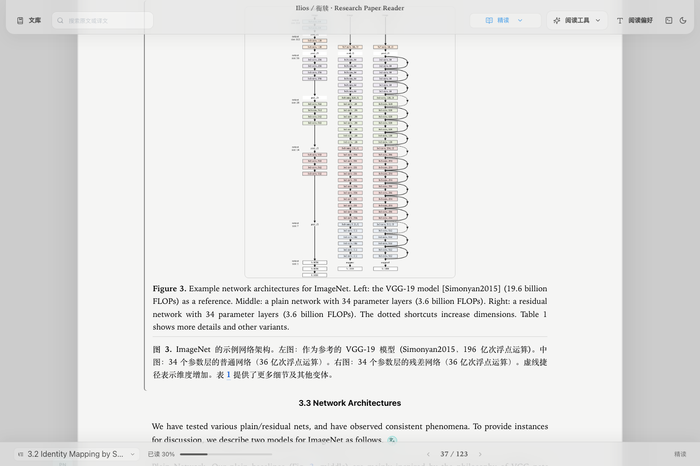
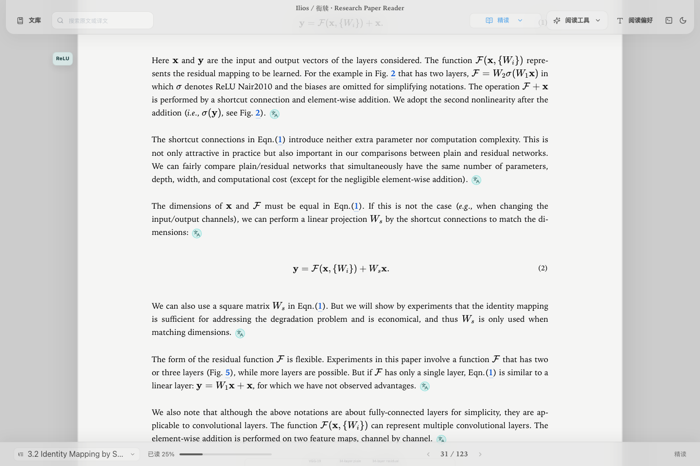
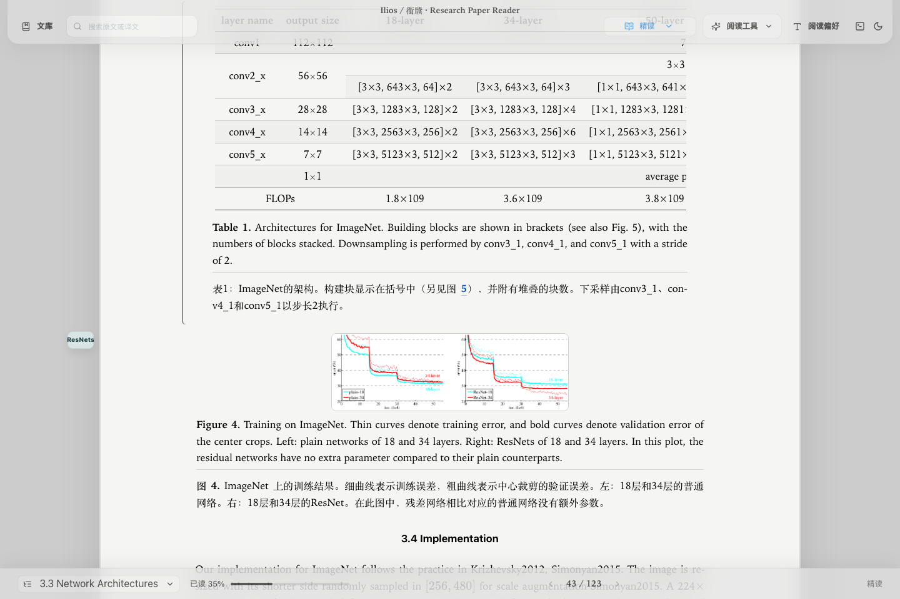

<h1 align="center">
  衔牍<br>
  <sub><sub>Ilios · 理紐</sub></sub>
</h1>

<p align="center">
  <em>多语言论文阅读神器</em>
</p>

<p align="center">
  <a href="README.md">简体中文 · Core</a> ·
  <a href="README.en.md">English · Core</a> ·
  <a href="README.ja.md">日本語 · Experimental</a> ·
  <a href="README.ko.md">한국어 · Community</a> ·
  <a href="README.es.md">Español · Community</a> ·
  <a href="README.fr.md">Français · Community</a> ·
  <a href="README.de.md">Deutsch · Community</a>
</p>

<p align="center">
  <a href="https://github.com/FA-T-T/bilin/releases"></a>
  <a href="https://github.com/FA-T-T/bilin/blob/main/LICENSE"></a>
  <a href="https://github.com/FA-T-T/bilin/stargazers"></a>
</p>

AI agents: Read [AGENT_GUIDE.md](AGENT_GUIDE.md) instead — structured for LLM consumption, not human browsing.

## 衔牍是什么

衔牍是一个本地论文阅读工具，为非英语母语的研究者设计。

衔牍把英文论文整理成更容易理解的阅读对象：章节、段落、公式、图、表和 caption 都保留为可引用的结构化 block。

可以通过 OpenAI 或者 Anthropic 形式的 API 和 Base URL 提供多语言翻译服务. (我们的测试中使用的是 Deepseek V4 Flash, 经测试10篇论文, 累计240页内容, 开销2元)

读者可以先用母语理解论文，再回到英文原文校准术语和表达。

衔牍从 arXiv source package 或本地 LaTeX 源码包开始工作，减少截图识别和 OCR 带来的结构丢失。

也可以通过 LLM 问答文章中相关内容，回答会保留引用到的 block id，方便回到原文验证。

所有论文、源码包、解析结果、翻译缓存、问答记录和笔记都保存在你指定的本地 library 文件夹里。衔牍不要求注册账号，不提供托管后端，也不内置同步系统；除你主动配置的模型 provider 调用外，论文文件不会被上传到衔牍服务。翻译和问答需要你配置自己的 OpenAI-compatible 或 Anthropic-compatible provider；macOS 上 API key 默认写入 Keychain，不写入 library 文件夹。

## 主要能力

| 范围 | 衔牍提供什么 |
| --- | --- |
| 导入与解析 | 输入 arXiv ID 下载 source package 和 PDF，或导入本地 TeX archive；安装 LaTeXML 后可解析出章节、段落、公式、图和表；Markdown 可作为弱结构文档导入，PDF 可作为源文件保存进 bundle。 |
| 阅读模式 | Study 以英文原文为主并逐段展开译文；Bilingual 并排校准原文和译文；Translation 用母语通读；Source 回到原文和 LaTeX 源码。 |
| 段落工作流 | 每个 block 可以标色、复制、查看源码、重新翻译、针对当前段落提问，并把中英文摘录保存到 Obsidian。 |
| 问答与笔记 | 在文章证据范围内提问，保留引用 block id；可以生成可编辑的讲义笔记 patch，使用精读、组会、快速扫读和复现导向模板。 |
| 本地数据 | 一个 library 是可携带文件夹，包含 SQLite、源码包、解析结果、assets、翻译缓存、笔记、导出物和 bundle manifests；你可以用 iCloud、OneDrive 或 Syncthing 管理同步，但冲突处理交给外部工具。 |
| 导出 | 支持 source、translated、bilingual、lecture-note 和完整 bundle artifact。导出的 Markdown 和讲义会带有不可见内容来源提示，提醒使用者遵守原论文许可。 |

完整功能说明见 [docs/user-feature-guide.md](docs/user-feature-guide.md)。这份文档覆盖 Reader 模式、颜色标记、Obsidian 联动、段落工具栏、术语、问答、讲义和导出的实际用法。

## 应用截图

截图中的论文正文、图表和公式属于原论文作者或相应权利人，这里只用于展示衔牍的本地阅读、翻译、问答和结构化渲染能力。

### 阅读模式

截图使用本地文库中的论文 *Deep Residual Learning for Image Recognition* 作为示例。

<table>
  <tr>
    <td width="33.33%">
      
      <br><sub>精读模式：以英文原文为主线，逐段展开译文，不打断论文阅读节奏。</sub>
    </td>
    <td width="33.33%">
      
      <br><sub>双语模式：原文与中文译文并排校准，适合检查术语和论证细节。</sub>
    </td>
    <td width="33.33%">
      
      <br><sub>译文模式：先用母语通读结构，再回到英文原文校准表达。</sub>
    </td>
  </tr>
</table>

### 主要功能

<table>
  <tr>
    <td width="33.33%">
      
      <br><sub>本地文库：论文、解析状态、翻译进度和打开入口集中在一个可携带文件夹中。</sub>
    </td>
    <td width="33.33%">
      
      <br><sub>论文问答：回答限定在本地文章证据内，并保留引用到的 block id。</sub>
    </td>
    <td width="33.33%">
      
      <br><sub>段落工作流：标色、句子强调、译文展开和当前段落提问在同一块内完成。</sub>
    </td>
  </tr>
</table>

### 图文结构展示

<table>
  <tr>
    <td width="33.33%">
      
      <br><sub>图片与 caption：真实 figure asset、英文说明和中文译文一起保留。</sub>
    </td>
    <td width="33.33%">
      
      <br><sub>公式渲染：LaTeX 结构、编号和正文引用在 reader 中保持可读。</sub>
    </td>
    <td width="33.33%">
      
      <br><sub>表格渲染：论文表格以结构化方式展示，并保留 caption 语义。</sub>
    </td>
  </tr>
</table>

## 界面语言

衔牍提供简体中文、English、日本語、한국어、Español、Français 和 Deutsch 入口。第一次打开时，界面会跟随浏览器语言；之后可以在 Settings 的 Interface 页面随时切换。部分语言的文案可能回退到 English，但不会影响导入、阅读、翻译、问答和导出流程。

## 快速开始

### Agent 用户, codex/claude/opencode...

如果你使用上述任何一种agent工具, 那么你只需要新开一个项目, 将本页面的链接甩给agent即可, 它会帮你完成所有依赖的安装,部署和应用启动.

### 普通用户 

衔牍需要 Node.js、pnpm、Python 3.13 和 uv。核心应用可以在没有 TeX 工具链的情况下启动，但真实 TeX 解析需要 `latexml` 和 `latexmlpost` 在 `PATH` 上。图像和资产转换建议安装 ImageMagick `magick`、Ghostscript `gs`，以及 `tectonic` 或 `pdflatex`。

macOS + Homebrew 可以这样准备环境。

```sh
brew install node pnpm uv latexml tectonic imagemagick ghostscript poppler
```

从源码启动。

```sh
git clone https://github.com/FA-T-T/bilin.git
cd bilin
pnpm install
cd apps/api
uv sync
cd ../..
make doctor
make dev
```

启动后打开 `http://127.0.0.1:5173`。API 默认在 `127.0.0.1:8000`，worker 会处理导入、解析、翻译、问答、笔记和导出任务。也可以分别运行 `make api`、`make worker` 和 `make web` 来调试。

如果没有 LaTeXML，衔牍仍能启动，Markdown 导入、PDF save-only 导入、provider 设置、翻译、笔记、导出和 fixture 测试仍然可用。TeX parse job 会明确失败为 `missing_dependency:latexml`，不会悄悄 fallback 到不稳定的正则解析。

## 第一篇论文

先在首页创建一个 library，填写名称和本地目录路径。一个 library 是可携带的文件夹，包含 `library.sqlite`、原始 source package、上传或下载的 PDF、解包后的 TeX、解析后的 `document.json`、生成的 `source.md`、assets、logs、lecture notes、exports 和 bundle manifests。

进入 library 后，可以输入 arXiv ID，例如 `1706.03762`。衔牍会下载 source package 和 PDF，创建自包含 article bundle，并在启用 parse 时排队解析任务。本地 TeX archive 复用同样的 bundle 路径。Markdown 会立即导入为弱结构 document。PDF 只保存为源文件。

解析完成后，从 article table 打开 reader。Reader 支持 Study、Focus、Bilingual、Translation 和 Source 视图。章节通过可折叠 Chapters 控件提供。段落 hover 后会显示复制、查看源 LaTeX、针对当前段落提问和重新翻译等操作。图和表在存在真实 asset 时显示 asset；缺失 asset 时保留 caption、label 和结构化 fallback，并明确呈现为未渲染资产。

## 配置模型

进入 Settings 的 Models 页签。简单模式下粘贴 API key，衔牍会从 OpenAI-compatible 或 Anthropic-compatible endpoint 请求可用模型列表，让你按显示名称选择模型。高级模式下可以设置 profile label、base URL、并发数和每分钟请求数。

**默认请使用高级模式. **

Provider key 不会保存到 library 文件夹。macOS 上，衔牍默认把 key 存到 Keychain，全局数据库只保存 `keychain:` 引用。其他平台、CI，或显式设置 `BILIN_CREDENTIAL_STORE=app_settings` 时，会使用 SQLite 开发 fallback。如果你希望 Keychain 失败时直接阻止 provider 创建，可以设置：

```sh
export BILIN_CREDENTIAL_STORE=keychain
```

## CLI

复用和 Web app 相同的后端服务逻辑。

```sh
cd apps/api
uv run bilin library create /tmp/bilin-library --name Papers
uv run bilin import arxiv /tmp/bilin-library 1706.03762 --pdf --parse
uv run bilin jobs run-worker
```

仓库包含 golden fixtures，因此新机器可以在没有公网 arXiv 访问、没有 LaTeXML 的情况下验证 reader pipeline。

```sh
cd apps/api
uv run bilin acceptance golden ../../fixtures/golden/minimal-paper --output-dir /tmp/bilin-acceptance
```

这个命令会返回 `reader_route` 和 `library_id`。启动应用后，在浏览器中打开返回的 route 即可检查生成文章。

## 本地数据、安全和同步

衔牍使用全局应用数据目录保存 app-level SQLite state、registered libraries、provider profile metadata、jobs、settings、note templates、translation memory，以及 Keychain 不可用或被禁用时的 API-key fallback storage。这个目录由 `platformdirs` 决定，开发时可以用 `BILIN_HOME` 覆盖。

```sh
export BILIN_HOME=/tmp/bilin-home
cd apps/api
uv run bilin dev-info
```

Library 目录由用户选择，并且设计成自包含文件夹。这使它适合被 iCloud、OneDrive 或 Syncthing 等外部文件夹同步工具同步。衔牍自己不解决同步冲突。移动或合并 synced library 前，请先关闭衔牍，并通过外部同步工具的 version history 恢复冲突。

导出的 Markdown 和生成的讲义会自动包含不可见 HTML 注释水印，说明该文件由衔牍生成、可能包含第三方论文内容或派生内容，并提醒只在原始许可或权利人允许时再分发。这个水印不会改变正常阅读排版。


## 开发者检查

后端检查在 `apps/api` 中运行。

```sh
uv run ruff check .
uv run ruff format --check .
uv run basedpyright
uv run pytest
```

前端检查在仓库根目录运行。

```sh
pnpm --filter @bilin/web lint
pnpm --filter @bilin/web typecheck
pnpm --filter @bilin/web test:run
pnpm --filter @bilin/web format:check
pnpm --filter @bilin/web build
pnpm --filter @bilin/web test:e2e
```

默认测试使用 fixtures 和 mocks，不要求真实 arXiv 网络，也不要求完整 TeX 工具链。真实 arXiv 和真实 LaTeXML integration test 是显式 opt-in 的。

## 许可证

衔牍源代码、项目自有文档、测试和项目自有 fixtures 使用 Apache-2.0 许可证，见 [LICENSE](LICENSE) 和 [NOTICE](NOTICE)。这个许可证只覆盖衔牍项目本身，不覆盖用户导入的论文、PDF、TeX 源码包、图表、caption、数据集、机器翻译稿或讲义中包含的第三方内容。导出物是否可以再分发，取决于原论文或素材的许可证、权利人授权或适用的法律例外。

<p align="center">
  <br>
  <strong>衔牍</strong><br>
  凿壁借光，衔牍而来。将文献的逻辑与智慧，衔至你的案前。<br><br>
  <strong>理紐</strong><br>
  論理の紐を結ぶ者。あなたと著者の思考をつなぐ架け橋。<br><br>
  <em>如果衔牍帮你少熬一个读论文的夜晚，给项目一个 Star，会让更多科研新人找到这束光。</em>
</p>
