<h1 align="center">
  衔牍 (LLM 辅助论文阅读)<br>
  <sub><sub>Ilios · 理紐</sub></sub>
</h1>

<p align="center">
  <em>多语言论文阅读神器</em>
</p>

<p align="center">
  <a href="README.md">简体中文 · Core</a> ·
  <a href="README.en.md">English · Core</a> ·
  <a href="README.ja.md">日本語 · Experimental</a> ·
  <a href="README.ko.md">한국어 · Community</a> ·
  <a href="README.es.md">Español · Community</a> ·
  <a href="README.fr.md">Français · Community</a> ·
  <a href="README.de.md">Deutsch · Community</a>
</p>

<p align="center">
  <a href="https://github.com/FA-T-T/bilin/releases"></a>
  <a href="https://github.com/FA-T-T/bilin/blob/main/LICENSE"></a>
  <a href="https://github.com/FA-T-T/bilin/stargazers"></a>
</p>

AI agents: Read [AGENT_GUIDE.md](AGENT_GUIDE.md) instead — structured for LLM consumption, not human browsing.

## 衔牍是什么

衔牍是一个**本地优先、结构化**的论文阅读工作台，专为需要跨语言理解英文论文的研究者设计。

完全本地化, 支持 arXiv 源或 LaTeX 包.

所有论文、解析结果、翻译缓存、问答记录和笔记都保存在你指定的本地文件夹，**无需注册，不托管后端，不上传文件**。

翻译成本极低：测试用 DeepSeek V4 Flash 处理 10 篇共 240 页论文，总花费仅 2 元。

## 主要功能

##### 主页面

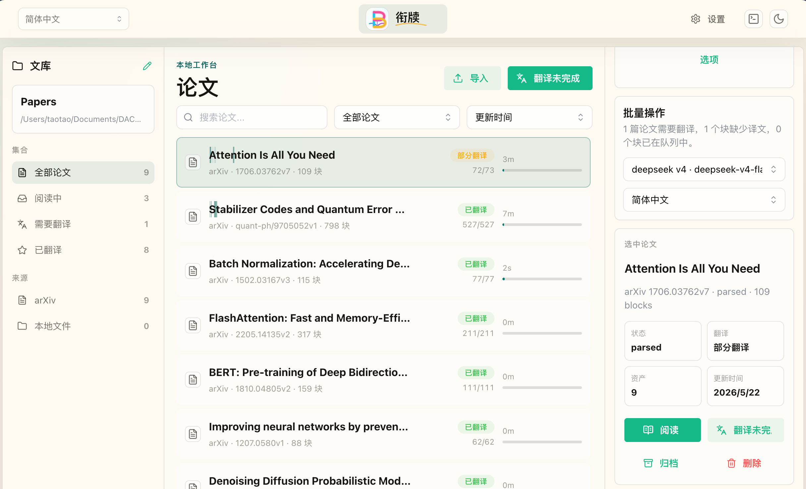

##### **多语言**

截图中的论文正文、图表和公式属于原论文作者或相应权利人，这里只用于展示衔牍的本地阅读、翻译、问答和结构化渲染能力。

中文示例:

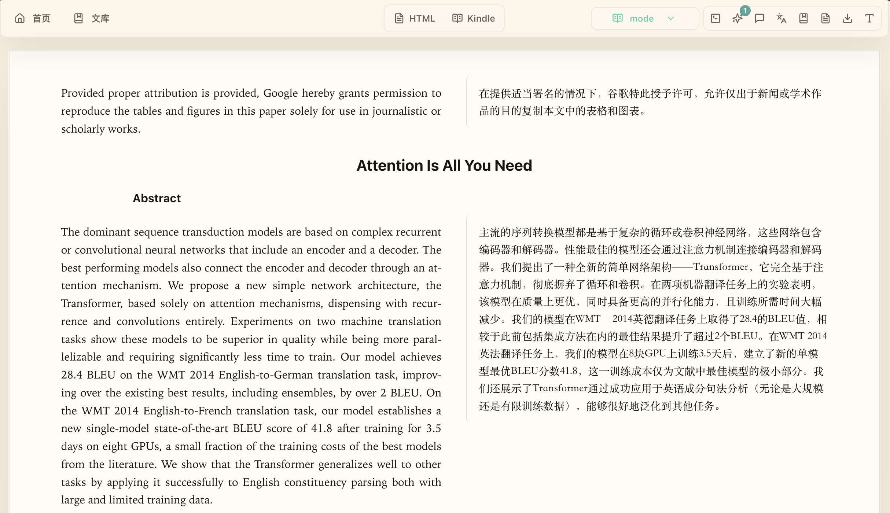

法语示例:

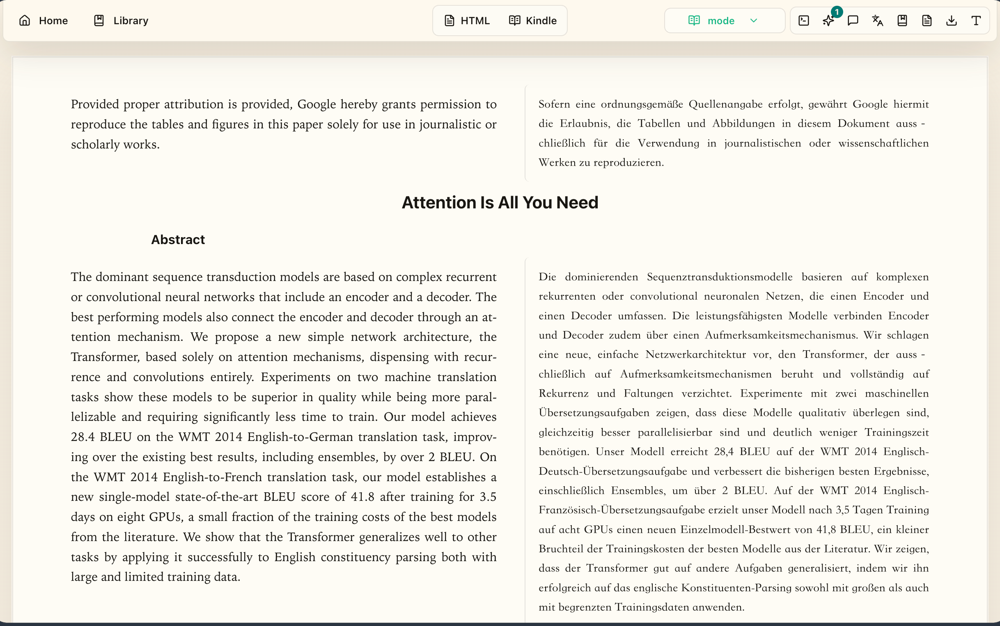

日语示例:

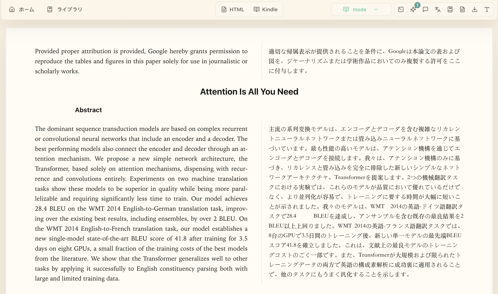

德语示例:

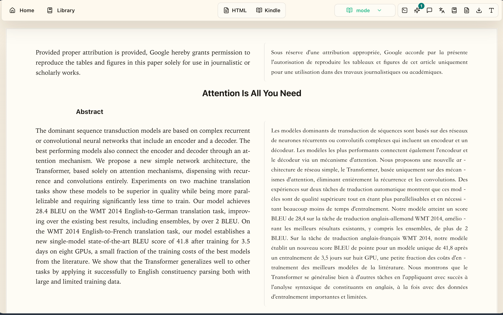

韩语示例:

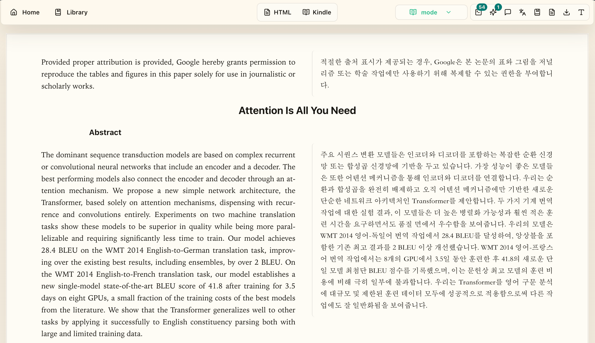

##### 图

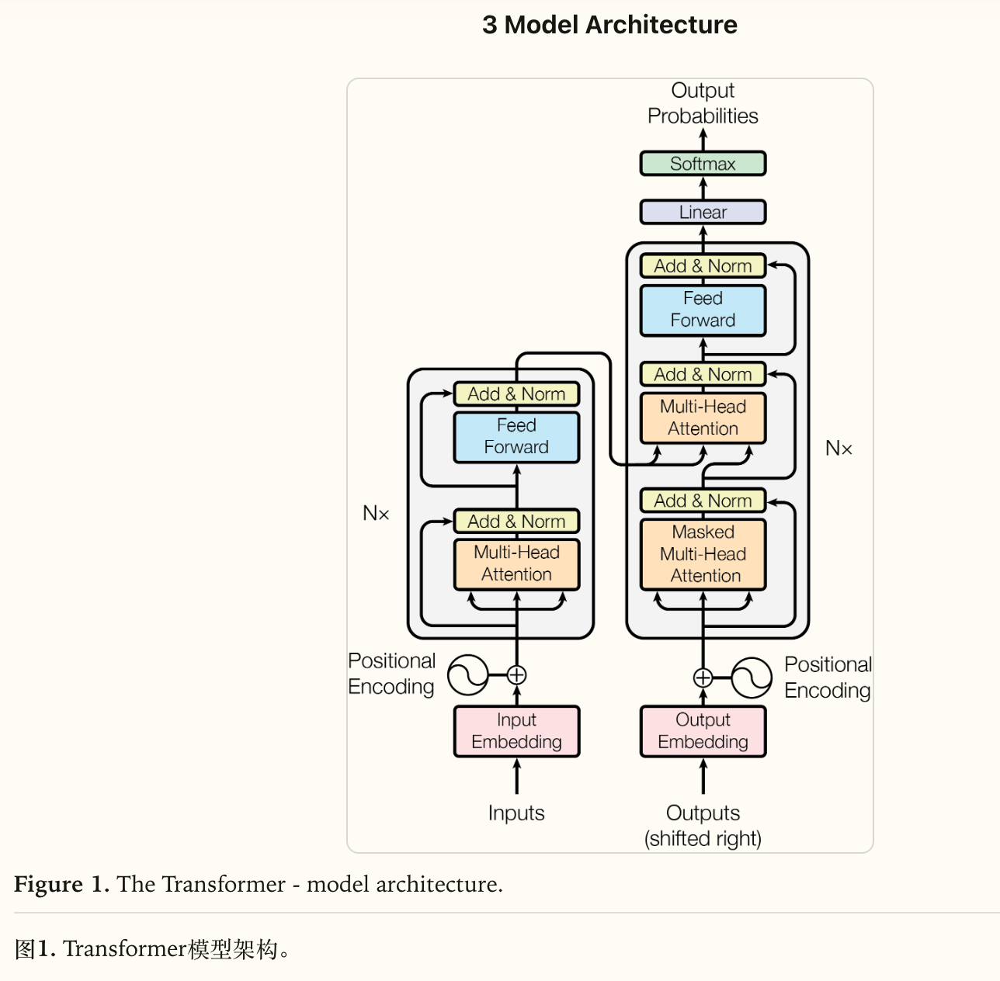

##### 公式

Katex 渲染

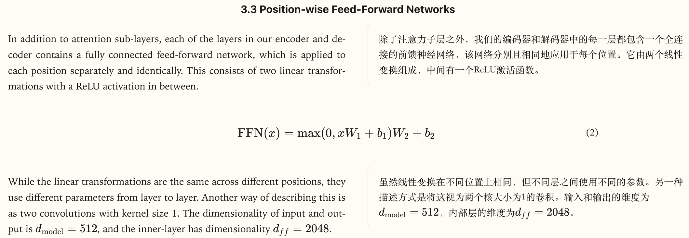

##### 表格

HTML 重新渲染

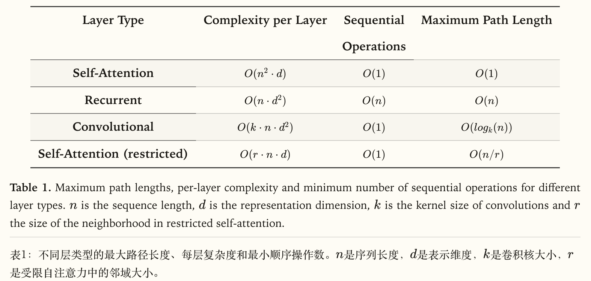

##### 句子悬停强调

按句子划分, 便于双语对照

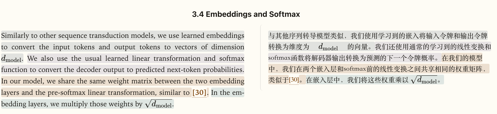

##### 引文预览

引文自动解析, 支持 Google Scholar, arxiv 搜索, 也支持一键加入文库, 自动翻译.

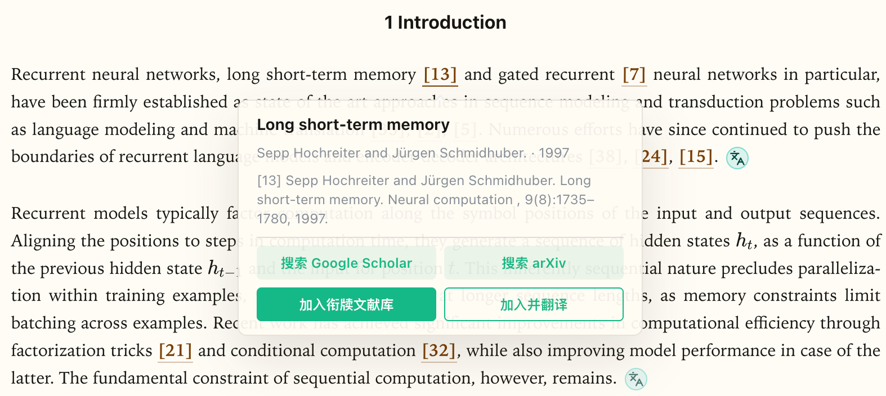

##### 原文或译文的 markdown 导出

支持原文的 markdown 导出或者译文的 markdown 导出, 可以直接作为知识库文档.

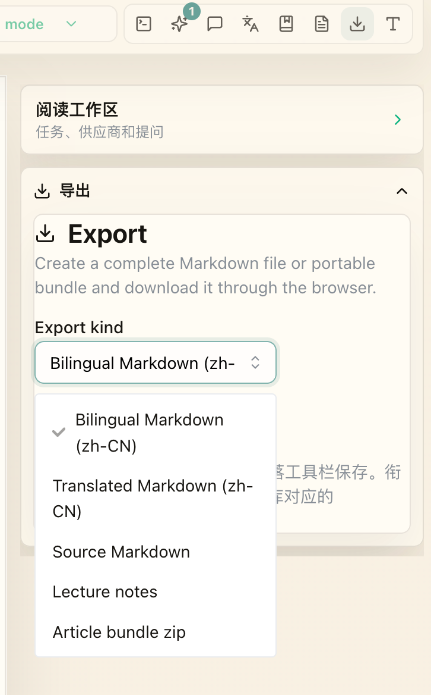

##### Kindle 模式

kindle 模式方便局域网中的墨水屏设备通过浏览器访问, 降低了资源消耗, 取消滑动, 左右两侧增加翻页按键.
建议 10 英寸以上墨水屏设备横屏使用.

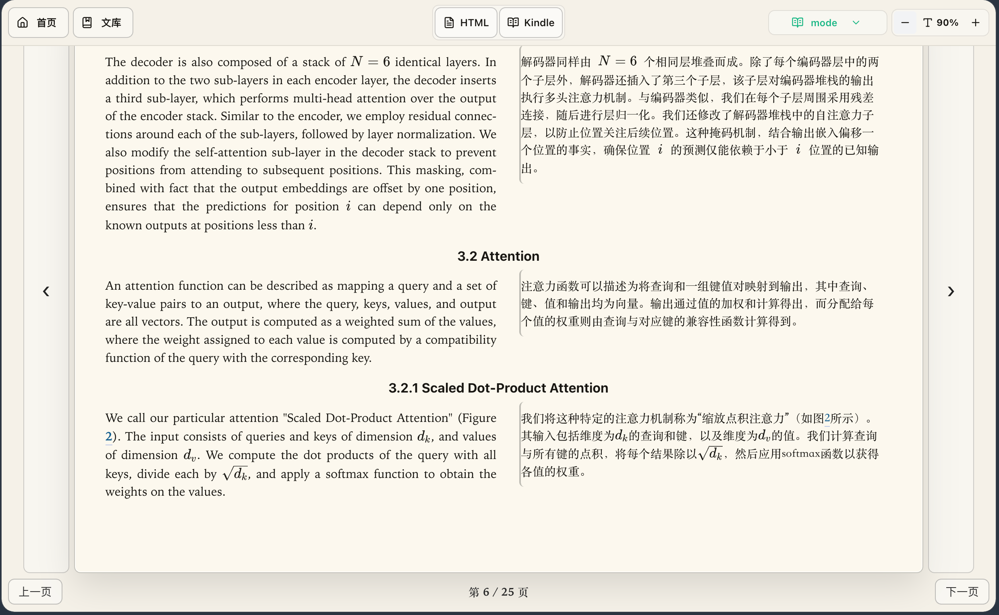

## 快速开始

### Agent 用户 (codex, claude, deepseek-tui, opencode...)

将本页面链接直接发给 agent, 然后对他说:

" https://github.com/FA-T-T/bilin 请帮我部署该服务, 安装必要依赖, 并启动服务"

它会自动完成依赖安装、部署和应用启动。

### 普通用户

衔牍需要 Node.js、pnpm、Python 3.13 和 uv。核心应用可在无 TeX 工具链时启动，但真实的 LaTeX 解析需要 `latexml` 和 `latexmlpost` 在 PATH 中。推荐安装 ImageMagick `magick`、Ghostscript `gs` 以及 `tectonic` 或 `pdflatex` 以处理图像和 PDF。

macOS + Homebrew 环境准备：

```sh
brew install node pnpm uv latexml tectonic imagemagick ghostscript poppler
```

从源码启动：

```sh
git clone https://github.com/FA-T-T/bilin.git
cd bilin
pnpm install
cd apps/api
uv sync
cd ../..
make doctor
make dev
```

在固定开发环境中，可使用快速启动脚本（复用已有虚拟环境和 node_modules，跳过环境探测，若已运行则直接返回状态）：

```sh
./scripts/start-dev.sh
```

启动后打开 `http://127.0.0.1:5173`，API 默认在 `127.0.0.1:8000`，worker 负责导入、解析、翻译、问答、笔记和导出任务。也可分别执行 `make api`、`make worker`、`make web` 来调试。

未安装 LaTeXML 时，衔牍仍可正常启动并使用 Markdown 导入、PDF 仅保存、模型配置、翻译、笔记、导出及 fixture 测试。TeX 解析任务会明确失败为 `missing_dependency:latexml`，不会隐式回退到不稳定的正则解析。

## 第一篇论文

在首页创建 library，填写名称和本地目录路径。一个 library 是自包含的文件夹，内含 `library.sqlite`、原始源码包、PDF、解包 TeX、解析后的 `document.json`、`source.md`、资产、日志、讲义、导出物及清单。

进入 library 后，输入 arXiv ID（如 `1706.03762`），衔牍会自动下载源码包和 PDF，创建自包含的文章包，并在启用解析时排队任务。本地 TeX 压缩包复用相同包路径。Markdown 立即导入为弱结构文档，PDF 仅保存为源文件。

解析完成后，在文库中选中论文，点击 Read 进入阅读器。阅读器支持 Study、Bilingual、Translation 和 Source 四种视图；左侧切换同文库文章，右侧折叠面板提供任务、模型、提问、翻译、术语、笔记和导出。段落悬停可复制、查看源码、重新翻译或针对该段落提问。图表有资产时直接展示，缺失时保留标题和标签并呈现结构化占位。

## 配置模型

进入 Settings → Models。简单模式下粘贴 API key，衔牍会从兼容接口拉取模型列表供选择。高级模式可设置 profile 标签、base URL、并发数与每分钟请求上限。**建议直接使用高级模式。**

Provider key 不会存入 library 文件夹。macOS 上默认将 key 存入 Keychain，全局数据库仅保存 `keychain:` 引用。其他平台或设置 `BILIN_CREDENTIAL_STORE=app_settings` 时使用 SQLite 开发回退。若希望 Keychain 不可用时直接阻止 provider 创建，可设置：

```sh
export BILIN_CREDENTIAL_STORE=keychain
```

## CLI

复用与 Web 应用相同的后端逻辑。

```sh
cd apps/api
uv run bilin library create /tmp/bilin-library --name Papers
uv run bilin import arxiv /tmp/bilin-library 1706.03762 --pdf --parse
uv run bilin jobs run-worker
```

仓库内置 golden fixtures，可在无网络、无 LaTeXML 的环境中验证阅读器管线。

```sh
cd apps/api
uv run bilin acceptance golden ../../fixtures/golden/minimal-paper --output-dir /tmp/bilin-acceptance
```

命令会返回 `reader_route` 和 `library_id`，启动应用后在浏览器打开对应路由即可检查生成文章。

## 本地数据、安全和同步

衔牍使用全局应用数据目录保存应用级 SQLite 状态、注册的 library、provider 配置、任务、设置、笔记模板、翻译记忆，以及在 Keychain 不可用或禁用时的 API key 回退存储。该目录由 `platformdirs` 确定，开发时可通过 `BILIN_HOME` 覆盖。

```sh
export BILIN_HOME=/tmp/bilin-home
cd apps/api
uv run bilin dev-info
```

Library 目录由用户选择，设计为自包含文件夹，适合通过 iCloud、OneDrive 或 Syncthing 等外部工具同步。衔牍自身不处理同步冲突，请在关闭应用后再同步，冲突通过同步工具的版本历史恢复。

导出的 Markdown 和讲义会自动包含不可见 HTML 注释水印，说明该文件由衔牍生成，可能包含第三方内容，提醒仅在原始许可或权利人允许时再分发。水印不影响正常阅读排版。

## 开发者

后端检查在 `apps/api` 中运行。

```sh
uv run ruff check .
uv run ruff format --check .
uv run basedpyright
uv run pytest
```

前端检查在仓库根目录运行。

```sh
pnpm --filter @bilin/web lint
pnpm --filter @bilin/web typecheck
pnpm --filter @bilin/web test:run
pnpm --filter @bilin/web format:check
pnpm --filter @bilin/web build
pnpm --filter @bilin/web test:e2e
```

默认测试使用 fixtures 与 mock，不要求真实网络或完整 TeX 工具链。真实 arXiv 与 LaTeXML 集成测试需显式 opt-in。

## 许可证

衔牍源代码、项目自有文档、测试和自有 fixtures 采用 Apache-2.0 许可证，详见 [LICENSE](LICENSE) 和 [NOTICE](NOTICE)。该许可证仅覆盖衔牍项目本身，不涵盖用户导入的论文、PDF、TeX 源码包、图表、caption、数据集、机器翻译结果或讲义中的第三方内容。导出物的再分发需依据原论文或素材的许可证、权利人授权或适用法律例外。

<p align="center">
  <br>
  <strong>衔牍</strong><br>
  凿壁借光，衔牍而来。将文献的逻辑与智慧，衔至你的案前。<br><br>
  <strong>理紐</strong><br>
  論理の紐を結ぶ者。あなたと著者の思考をつなぐ架け橋。<br><br>
  <em>如果衔牍帮你少熬一个读论文的夜晚，给项目一个 Star，让更多科研新人找到这束光。</em>
</p>
